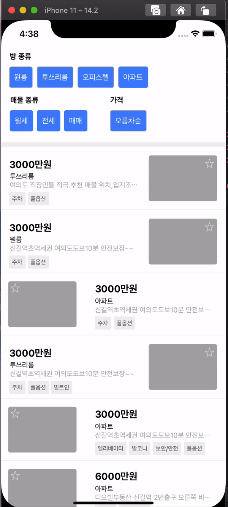
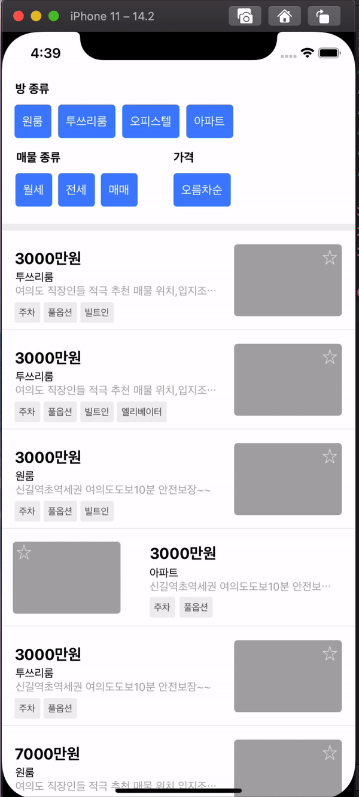

<h1 align="center">Dabang</h1>

  
  
  
  

  다방 사전 과제를 제출하는 레포지토리입니다.

 

### ✏️ Tableview 페이징 & 평균가 데이터 처리

 

### ✏️ 가격 정렬 (오름차순, 내림차순)

 

### ✏️ 필터 적용

 

### 사용 라이브러리

- [SwiftLint](https://github.com/realm/SwiftLint)
- [SnapKit](https://github.com/SnapKit/SnapKit)
- [Then](https://github.com/devxoul/Then)
